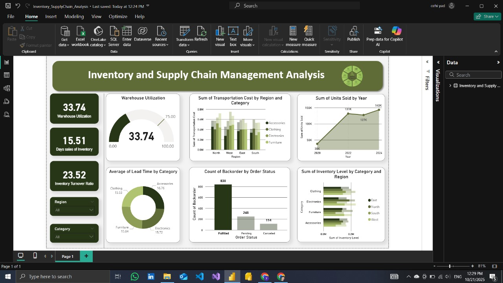
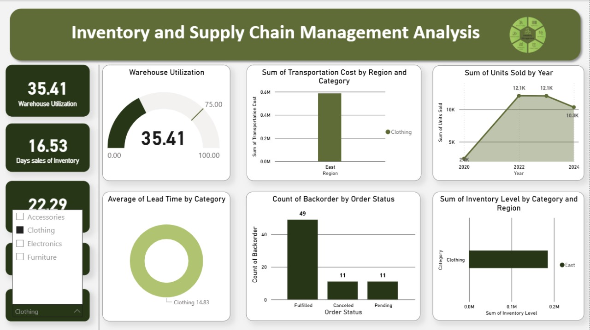

# 📊 Power BI Project: Inventory & Supply Chain Analysis

## 🚀 Project Overview
This Power BI project provides an end-to-end analysis of inventory and supply chain performance.  
It focuses on key areas like **stock management**, **supplier reliability**, **logistics efficiency**, and **demand insights** — all visualized through a professional, interactive dashboard.

---

## 🧩 Dataset
The dataset contains detailed operational metrics including inventory levels, supplier performance, and transportation costs.

**Sample Columns:**
- Date  
- Region  
- Category  
- Supplier  
- Warehouse  
- Order Status  
- Units Sold  
- Inventory Level  
- Transportation Cost  
- Order Accuracy  
- Lead Time (Days)  
- Backorder  
- Cost of Goods Sold (COGS)  
- Average Inventory  
- Warehouse Capacity  

---

## 🧹 Data Preparation
Performed in **Power Query**:
- Cleaned missing or inconsistent values  
- Converted data types  
- Created calculated columns and measures

---

## 📈 Key Metrics
- **Inventory Turnover Rate** = COGS / Average Inventory  
- **Order Fulfillment Rate** = Fulfilled Orders / Total Orders  
- **Supplier Reliability** = On-Time Deliveries / Total Deliveries  
- **Lead Time Average** = AVG(Lead Time Days)  
- **Warehouse Utilization** = Inventory Level / Warehouse Capacity  

---

## 🧠 Dashboard Insights
1. **Inventory Overview:** Stock trends, turnover rate, and warehouse utilization  
2. **Supplier Performance:** Delivery accuracy, lead time, and reliability  
3. **Logistics & Cost Analysis:** Transportation cost and efficiency metrics  
4. **KPI Summary:** At-a-glance view for executive decision-making  

---

## 🧰 Tools Used
- **Power BI** – Data modeling & visualization  
- **Power Query** – Data cleaning and transformation  
- **DAX** – Calculated measures and KPIs  
- **CSV** – Data source format  

---

## 📷 Dashboard Preview

---

## 📚 Project Goals
- Demonstrate end-to-end BI workflow  
- Apply real-world supply chain analytics  
- Showcase storytelling and design in Power BI  

---

## 👨‍💻 Author
**Youssef Lamadi**  
_Data Analyst | Power BI Enthusiast_

